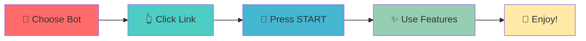

# <div align="center">⚡️ MOST POWERFUL TELEGRAM BOTS COLLECTION ⚡️</div>

<div align="center">


### 🚀 The Ultimate Suite of Telegram Utility Bots
*Supercharge your Telegram experience with our powerful bot collection*


[🎯 Get Started](#-our-amazing-bots) • [✨ Features](#-why-choose-our-bots) • [💎 Premium](#-premium-features) • [📞 Support](#-support--contact)


</div>

---

## 🎨 What Makes These Bots Special?

<div align="center">


</div>.png" width="50" /> **ENTERPRISE-LEVEL FUNCTIONALITY** 

</div>

```ascii
╔══════════════════════════════════════════════════════════════╗
║  🎯 Advanced Features  +  ⚡️ Lightning Fast  +  🔒 Secure  ║
║                    =  PERFECT BOTS ✨                        ║
╚══════════════════════════════════════════════════════════════╝
```


---

## 🤖 Our Amazing Bots

<div align="center">

</div>

### 1️⃣ 🚀 Auto Forward Bot ⚡️
**[@autoforwardroxybot](https://t.me/autoforwardroxybot)**

<div align="center">


</div>

>  **Advanced forwarding bot with special features**

#### ✨ Features:
- ⚡️ **Auto-Forward Messages** - Set it and forget it!
- 🔄 **Bulk Forwarding** - Process thousands of messages
- 📝 **Caption Editing** - Modify text on-the-fly
- ⏰ **Scheduled Forwards** - Time your messages perfectly
- 🎛️ **Smart Filters** - Forward only what you need
- 💾 **Save Configurations** - Reuse your settings

<div align="center">

```diff
+ Perfect for: Channel Managers 📢 Content Distributors 📡 News Aggregators 📰
```


</div>

---

<div align="center">


</div>

### 2️⃣ 🔒 Save Restricted Content Bot ⚡️
**[@Saverestrictedcontactroxybot](https://t.me/Saverestrictedcontactroxybot)**

<div align="center">


</div>

> 💎 **Save posts even from channels or groups with forwarding disabled**

#### ✨ Features:
- 💾 **Bypass Restrictions** - Save protected content
- 📥 **Download Everything** - Videos, audios, documents
- 🎬 **High Quality** - Original quality preserved
- 🖼️ **Image Support** - All formats supported
- ✂️ **No Watermarks** - Clean downloads
- 🚀 **Fast Processing** - Lightning speed downloads

<div align="center">

```diff
+ Perfect for: Content Collectors 📚 Researchers 🔬 Media Enthusiasts 🎥
```


</div>

---

<div align="center">

</div>

### 3️⃣ 🪪 User ID Bot - Instant Lookup!
**[@useridroxybot](https://t.me/useridroxybot)**

<div align="center">


</div>

> 👤 **Get any Chat ID instantly with just one click! 🚀**

#### ✨ Features:
- 🆔 **Instant User IDs** - Get IDs in milliseconds
- 👥 **Group/Channel IDs** - Works everywhere
- 📊 **User Analytics** - See detailed info
- ⚡️ **Super Fast** - No waiting time
- 🔍 **Forward Method** - Just forward any message
- 📱 **Bot Compatible** - Perfect for developers

<div align="center">

```diff
+ Perfect for: Bot Developers 👨‍💻 Group Admins 👮 Power Users 💪
```


</div>

---

<div align="center">

</div>

### 4️⃣ 📁 File Rename Bot ⚡️
**[@filerenameroxybot](https://t.me/filerenameroxybot)**

<div align="center">


</div>

> ✨ **Advanced File Tool - Rename • Thumb • Caption • Convert**

#### ✨ Features:
- 📝 **Smart Rename** - Custom names with templates
- 🖼️ **Custom Thumbnails** - Perfect previews
- 💬 **Caption Magic** - Auto-add captions
- 🔄 **Format Converter** - Video/Audio conversion
- 📦 **Batch Mode** - Process multiple files
- ⚡️ **Premium Speed** - Ultra-fast processing
- 🎨 **Metadata Editor** - Complete control

<div align="center">

```diff
+ Perfect for: Content Creators 🎬 File Organizers 📂 Media Managers 🎞️
```


</div>

---

<div align="center">

</div>

### 5️⃣ 🛡️ Roxy X Management Bot ⚡️
**[@roxyxmanagmentbot](https://t.me/roxyxmanagmentbot)**

<div align="center">


</div>

> 💫 **Smart group management bot with auto moderation & admin tools**

#### ✨ Features:
- 🛡️ **Auto Moderation** - Keep your group clean
- 👮 **Admin Controls** - Full management suite
- 🚫 **Anti-Spam Shield** - Block unwanted content
- 📊 **Analytics Dashboard** - Track group stats
- ⚙️ **Custom Rules** - Set your own filters
- 🎯 **Welcome System** - Greet new members
- 🤖 **AI Detection** - Smart spam identification
- 💬 **Auto Responses** - Set up custom replies

<div align="center">

```diff
+ Perfect for: Group Admins 👨‍💼 Community Managers 👥 Server Moderators 🎮
```


</div>

---

<div align="center">

</div>

## 🌟 Why Choose Our Bots?

<div align="center">

<table>
<tr>
<td align="center" width="33%">
<br>
<b>⚡️ Lightning Fast</b><br>
Optimized for speed<br>
Instant responses
</td>
<td align="center" width="33%">
<br>
<b>🔒 Secure</b><br>
Privacy first<br>
Data encrypted
</td>
<td align="center" width="33%">
<br>
<b>🎯 User-Friendly</b><br>
Simple commands<br>
Easy to use
</td>
</tr>
<tr>
<td align="center" width="33%">
<br>
<b>🆓 Free Forever</b><br>
Core features free<br>
No hidden costs
</td>
<td align="center" width="33%">
<br>
<b>💎 Premium Options</b><br>
Advanced features<br>
Power user tools
</td>
<td align="center" width="33%">
<br>
<b>🔄 24/7 Uptime</b><br>
Always available<br>
Never offline
</td>
</tr>
</table>

</div>

---

<div align="center">

</div>

## 🚀 Quick Start Guide

<div align="center">



</div>

### 📱 It's This Easy:

1.  **Choose Your Bot** - Click any bot link above
2.  **Start the Bot** - Press `/start` command
3.  **Follow Guide** - Use inline buttons
4.  **Enjoy!** - Start using powerful features

<div align="center">

</div>

---

## 💎 Premium Features

<div align="center">


### 👑 Unlock Full Power!

</div>

| Feature | Free | Premium |
|---------|------|---------|
| ⚡️ Daily Limits | 100 | ♾️ Unlimited |
| 🚀 Processing Speed | Standard | 🔥 10x Faster |
| 💾 Storage | 1GB | 100GB |
| 🎯 Advanced Tools | ❌ | ✅ |
| 👨‍💻 API Access | ❌ | ✅ |
| 💬 Priority Support | ❌ | ✅ |
| 🎨 Custom Branding | ❌ | ✅ |
| 📊 Analytics | Basic | Advanced |

<div align="center">

### 💰 Starting at just $5/month!


**[Get Premium Now!](https://t.me/roxybasicneedbot1)** 🚀

</div>

---

<div align="center">

</div>

## 📊 Live Statistics

<div align="center">


<table>
<tr>
<td align="center">
<br>
<b>👥 Total Users</b><br>
<h2>10,000+</h2>
</td>
<td align="center">
<br>
<b>📨 Messages</b><br>
<h2>1M+</h2>
</td>
<td align="center">
<br>
<b>⭐ Rating</b><br>
<h2>4.8/5</h2>
</td>
<td align="center">
<br>
<b>🔄 Uptime</b><br>
<h2>99.9%</h2>
</td>
</tr>
</table>


</div>

---

## 🛠️ Tech Stack

<div align="center">


</div>

---

## 📞 Support & Contact

<div align="center">


### 💬 Need Help? We're Here!

</div>

- 🤖 **Main Support Bot**: [@roxybasicneedbot1](https://t.me/roxybasicneedbot1)
- 📧 **Direct Contact**: Available through any bot
- 📚 **Documentation**: Type `/help` in any bot
- 🐛 **Report Issues**: Use `/feedback` command
- 💡 **Feature Requests**: We love suggestions!
- ⚡️ **Response Time**: Usually < 5 minutes

<div align="center">

```
💡 Pro Tip: Premium users get priority support with <1 minute response time!
```


</div>

---

## 🎯 Use Cases

<div align="center">

### 🚀 Real World Applications

</div>

```yaml
Content Creators:
  - Auto-forward content across channels
  - Rename files professionally
  - Save restricted media for reference

Group Admins:
  - Manage multiple groups efficiently
  - Auto-moderate spam and unwanted content
  - Welcome new members automatically

Developers:
  - Get user/chat IDs instantly
  - Test bot integrations
  - Build automation workflows

Businesses:
  - Share content across teams
  - Organize media libraries
  - Monitor group activities
```

---

## 🏆 Awards & Recognition

<div align="center">

 


🏆 **Best Telegram Utility Bots 2024**
⭐ **10,000+ Happy Users**
🚀 **Featured in Top Bot Lists**

</div>

---

## 🤝 Contributing

<div align="center">


### 💪 Help Us Improve!

</div>

We love contributions! Here's how you can help:

1. 💡 **Share Ideas** - Submit feature requests
2. 🐛 **Report Bugs** - Help us fix issues
3. 📚 **Improve Docs** - Better documentation
4. 🌟 **Spread the Word** - Tell your friends
5. ⭐ **Star This Repo** - Show your support

<div align="center">

```
🎁 Contributors get special perks including premium access and recognition!
```

</div>

---

## ⚠️ Important Information

<div align="center">

### 📋 Please Read

</div>

- ✅ All bots comply with Telegram's Terms of Service
- ⚖️ Use of restricted content must follow copyright laws
- 🛡️ We're not responsible for misuse of these tools
- 🔒 Always respect privacy and content rights
- 📱 Bots are provided "as-is" for personal/commercial use

---

## 📈 Roadmap

<div align="center">


### 🔮 What's Coming Next?

</div>

- [ ] 🎨 Custom UI themes for each bot
- [ ] 🌍 Multi-language support (10+ languages)
- [ ] 🤖 AI-powered content suggestions
- [ ] 📱 Dedicated mobile apps
- [ ] 🔗 Public API for developers
- [ ] 📊 Advanced analytics dashboard
- [ ] 🎮 Gamification features
- [ ] 🌐 Web dashboard for management

---

<div align="center">


## 🌈 Built with ❤️ by ROXY Team


</a>
<a href="https://t.me/roxybasicneedbot1">

</a>
<a href="https://t.me/roxybasicneedbot1">

</a>

---

### ⭐ Don't Forget to Star This Repository! ⭐


---

**Last Updated**: November 2025 | **Version**: 2.0.0 | **Status**: 🟢 Active


### 📱 Quick Links:
[Bot 1](https://t.me/autoforwardroxybot) • [Bot 2](https://t.me/Saverestrictedcontactroxybot) • [Bot 3](https://t.me/useridroxybot) • [Bot 4](https://t.me/filerenameroxybot) • [Bot 5](https://t.me/roxyxmanagmentbot) • [Support](https://t.me/roxybasicneedbot1)

</div>

---

<div align="center">

### 🎉 Thank you for being awesome! 🎉


<img src="https://user-images.githubusercontent.com/74038190/216122041-518ac897-8d92-4c6b-9b3f-ca01dcaf38ee
